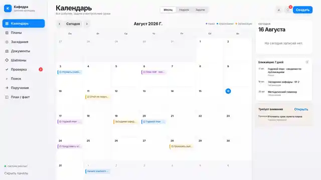
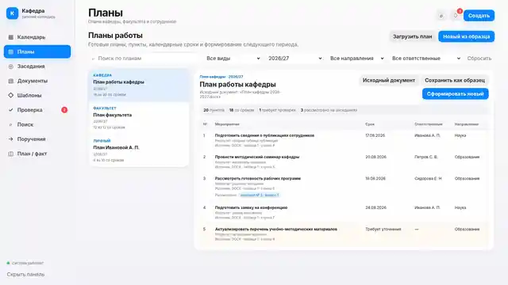
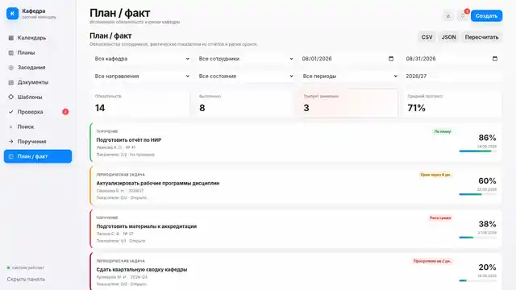
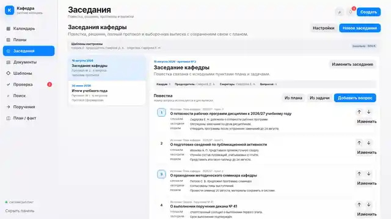

# Кафедра Planner

[Русский](README.md) · [English](README.en.md)

[](https://github.com/f2re/kafedra-planner/actions/workflows/ci.yml)
[](https://github.com/f2re/kafedra-planner/actions/workflows/release-gate.yml)
[](https://github.com/f2re/kafedra-planner/releases)
[](LICENSE)

Автономная система повседневной работы кафедры: документы, календарь, годовые планы, задачи, заседания, `План / факт`, научная деятельность и проверяемые доказательства.

> Текущий рубеж: **`0.3.4`**, схема SQLite **30**. Основные пользовательские контуры работают без обязательного Интернета, LLM, Docker и внешних облачных сервисов. До stable остаётся реальная эксплуатационная приёмка установки, обновления, восстановления и rollback на Astra Linux/Debian по [`docs/TARGET_ACCEPTANCE.md`](docs/TARGET_ACCEPTANCE.md) и issue #27.

**[Скачать опубликованный offline bundle](https://github.com/f2re/kafedra-planner/releases)** · **[Установить на Debian/Astra](docs/GITHUB_RELEASES.md)** · **[Открыть документацию](#архитектура-и-эксплуатационные-документы)** · **[Сообщить об уязвимости](SECURITY.md)**

GitHub Release и его assets неизменяемы и соответствуют точному tagged commit. Более поздний `main` с той же версией не переносит тег и не заменяет опубликованные файлы; для эксплуатации нового рубежа нужен следующий отдельный release.

## Основной принцип

Проект автоматизирует бюрократическую работу, а не переносит её в новые согласования.

```text
исходный документ / ручной ввод
              ↓
      рабочий план / заседание / задача
              ↓
 календарь · поиск · План / факт
              ↓
      редактирование и история
```

- загруженный план или документ заседания должен как можно раньше стать рабочим объектом;
- однозначные поля заполняются автоматически с источником и локатором;
- одна нераспознанная строка не блокирует остальные;
- задача завершается одним действием `Выполнено`;
- подтверждение руководителем и обязательный отчёт не требуются;
- PDF, DOCX, скан или справку можно приложить, но файл не влияет на состояние задачи;
- исходный файл, SHA-256, версии и история не уничтожаются.

Подробно: [`docs/SIMPLE_COMPLETION.md`](docs/SIMPLE_COMPLETION.md), [`docs/ARCHITECTURE.md`](docs/ARCHITECTURE.md).

## Что видит пользователь

При первом открытии пользователь задаёт PIN-код из четырёх цифр. Логин, регистрация и временный пароль в штатном режиме не нужны. После входа открывается календарь. На большом экране используется боковая навигация, на мобильном — нижние вкладки. Стартовый режим выбирается явно: `Автоматически / Месяц / Неделя / Задачи`.



Основные разделы:

- **Календарь** — месяц, неделя, задачи, сроки, напоминания и происхождение записей;
- **Документы** — загрузка, исходник, обработка, версии, OCR/preview, архив и доказательства;
- **Планы** — импорт готового плана или ручной годовой план, разбор строк, задачи и безопасный архив;
- **Поручения** — исполнители, прогресс, одно действие `Выполнено` и необязательные материалы;
- **План / факт** — плановые и фактические показатели, происхождение и риск срока;
- **Заседания** — повестка, решения, протоколы, выписки и библиотека версий шаблонов;
- **Наука** — статьи и другие научные материалы на общем контуре документов и поиска;
- **Настройки** — PIN, стартовый календарь, структура кафедры и импорт сотрудников из Оформлятора;
- **Проверка** — только неоднозначности, которые система не может безопасно разрешить сама.

## Годовой план

План кафедры, факультета, подразделения, организации или сотрудника можно импортировать из DOCX, ODT, XLSX, ODS, PDF или текста либо создать вручную.

Для пункта доступны режимы:

- **Контрольная точка** (`track`) — календарное событие или срок без отдельной задачи;
- **Назначенная задача** (`assigned`) — выбранные исполнители, необязательный контролирующий и прогресс;
- **Открытая задача** (`open`) — сотрудник атомарно принимает её в работу сам.

Реальный табличный документ сохраняется вместе с исходными строками, ячейками и локаторами. Одну строку можно разложить на несколько задач, каждой задать свои даты и исполнителей. Неизвестные колонки не выбрасываются.

Если ФИО ответственного точно совпадает с единственным активным сотрудником, система создаёт одну связанную задачу. Неоднозначное или отсутствующее совпадение не угадывается: исходное ФИО сохраняется, пункт уже существует и доступен для редактирования. Контролирующий определяется из оргструктуры, когда это возможно, но его отсутствие не блокирует выполнение.

Один пункт создаёт не более одной связанной задачи. Повторное сохранение обновляет существующую связь, а не создаёт дубль. `Выполнено` сразу синхронизирует задачу, пункт плана, календарь и `План / факт`.



Подробно: [`docs/PLANS.md`](docs/PLANS.md), [`docs/PLAN_SOURCE_ROWS.md`](docs/PLAN_SOURCE_ROWS.md), [`docs/MANUAL_PLANS.md`](docs/MANUAL_PLANS.md), [`docs/AUTOMATIC_ASSIGNMENTS.md`](docs/AUTOMATIC_ASSIGNMENTS.md).

## Задачи и «План / факт»

Задача может возникнуть из распоряжения или пункта плана. Для неё сохраняются основание, исполнители, срок, ожидаемый результат, прогресс и история.

Основной сценарий:

```text
задача
  ↓
прогресс / комментарий
  ↓
Выполнено
  ↓
план · календарь · План / факт
```

Руководитель видит разрешённое состояние, но не обязан подтверждать или возвращать результат. Действие `Вернуть в работу` оставляет завершение обратимым.

Подтверждающие материалы необязательны. Их можно приложить до или после выполнения. Автоматическое сопоставление загруженного документа с задачей является только предложением связи: оно не закрывает задачу и не создаёт очередь согласования.




Подробно: [`docs/SIMPLE_COMPLETION.md`](docs/SIMPLE_COMPLETION.md), [`docs/WORKFLOW_DOCUMENTS.md`](docs/WORKFLOW_DOCUMENTS.md), [`docs/PLAN_FACT.md`](docs/PLAN_FACT.md), [`docs/PLAN_FACT_OPERATIONS.md`](docs/PLAN_FACT_OPERATIONS.md).

## Заседания



Заседание существует как самостоятельная запись до появления итогового файла. Повестка формируется вручную, из пункта плана или задачи. Для каждого вопроса фиксируются фактические `Слушали / Обсудили / Решили`; затем система формирует полный протокол либо выписку.

Библиотека DOCX-шаблонов хранит версии, основной шаблон, тестовое заполнение, impact, обратимый архив и восстановление. Каждая генерация ссылается на точную историческую версию шаблона. Необязательный LibreOffice preview не отменяет готовый DOCX.

Сформированный файл регистрируется как обычный неизменяемый документ. Повтор неизменённого запроса не создаёт копию.

Подробно: [`docs/MEETINGS.md`](docs/MEETINGS.md), [`docs/MEETING_TEMPLATES.md`](docs/MEETING_TEMPLATES.md).

## Импорт сотрудников из Оформлятора

В **Настройки → Структура кафедры → Импорт из Оформлятора** администратор указывает HTTP/HTTPS, адрес и порт локального сервера. Проверка соединения отдельно проверяет `/healthz`, `/readyz` и прикладные данные. Четырёхзначный код используется только для текущего запроса и не сохраняется.

Можно выбрать пространство, группу или всех сотрудников и предварительно увидеть количество и ФИО. Синхронизация идемпотентна по `remote employee id`; первая загрузка может сопоставить существующего человека по нормализованному ФИО. Повторный импорт обновляет ту же запись и не удаляет локальные планы, задачи, назначения и историю.

Интеграция необязательна: локальный справочник и все основные сценарии работают без Оформлятора и без сети.

Подробно: [`docs/DOCOMATOR_PEOPLE_IMPORT.md`](docs/DOCOMATOR_PEOPLE_IMPORT.md).

## Документы и локальная обработка

- потоковая загрузка с ограничением размера;
- SHA-256 и content-addressed blob-хранилище;
- неизменяемые версии и дедупликация без потери истории;
- устойчивая очередь с арендой и повтором после перезапуска;
- DOCX, ODT, XLSX, ODS, PDF, TXT, Markdown, CSV и JSON;
- локальные `unzip`, Poppler, Tesseract и LibreOffice в полном offline bundle;
- структурные абзацы, таблицы, листы, страницы и локаторы источника;
- FTS5 и фасетный поиск;
- ручная коррекция без уничтожения машинного результата.

Ошибка одного файла не останавливает очередь. Дополнительные document converters могут работать в degraded mode; исходники и функции, не требующие конвертера, остаются доступны.

Подробно: [`docs/OCR_AND_PREVIEW.md`](docs/OCR_AND_PREVIEW.md), [`docs/STRUCTURED_DOCUMENTS.md`](docs/STRUCTURED_DOCUMENTS.md), [`docs/OFFLINE_INSTALL.md`](docs/OFFLINE_INSTALL.md).

## Архив и безопасная замена

Ошибочно загруженный документ или устаревший план не удаляется физически. Перед архивированием система показывает связанные пункты, календарные записи, задачи, шаблоны, материалы и другие зависимости. При необходимости можно указать активный объект-преемник.

Замена используется только для навигации и не перепривязывает исторические факты. Исходная версия, SHA-256, пункт плана, календарная проекция, задача и evidence продолжают ссылаться на первоначальный источник. Восстановление возвращает объект в рабочий список.

Подробно: [`docs/DOCUMENT_PLAN_LIFECYCLE.md`](docs/DOCUMENT_PLAN_LIFECYCLE.md).

## LLM / llama.cpp

LLM — только необязательное локальное улучшение. Основной deterministic-контур полностью работает при `KAFEDRA_LLM_ENABLED=false`.

Доступны:

1. внешний OpenAI-compatible `llama-server`;
2. полный offline bundle с локальным `llama.cpp` и GGUF-моделями.

Сборка LLM-варианта выполняется на reference/build-машине:

```bash
npm run bundle:offline:llm -- \
  --llama-runtime /srv/kafedra/llama-runtime \
  --model qwen=/srv/models/model.gguf \
  --default-model qwen \
  --output release-llm
```

Подробно: [`docs/LLAMA_OFFLINE_DEPLOYMENT.md`](docs/LLAMA_OFFLINE_DEPLOYMENT.md), [`docs/DIRECTIVES_AND_LLM.md`](docs/DIRECTIVES_AND_LLM.md).

## Установка на Astra Linux / Debian

На целевой машине не требуются `npm install` или `pip install`. Скачайте обязательные файлы из [GitHub Releases](https://github.com/f2re/kafedra-planner/releases), проверьте контрольные суммы и запустите wrapper:

```bash
sudo ./install-kafedra-planner.sh
```

Для гарантированного air-gap режима:

```bash
sudo KAFEDRA_APT_MODE=bundle ./install-kafedra-planner.sh
```

После установки откройте напечатанный адрес и задайте четырёхзначный PIN. Installer перед изменяющим обновлением создаёт и проверяет резервную копию, переключает versioned release атомарно и выполняет rollback при неуспешной миграции или health-check.

Проверка:

```bash
sudo /opt/kafedra-planner/current/scripts/offline/doctor.sh
systemctl status kafedra-planner-api kafedra-planner-worker --no-pager -l
```

Package contract — `full-airgap-v2 / additive-only-v2`: перед изменением ОС выполняется `apt-get check`; `--no-upgrade --no-remove` и simulation guard не позволяют заменить уже установленную Astra/Debian версию. `apt --fix-broken` автоматически не вызывается.

Подробно: [`docs/GITHUB_RELEASES.md`](docs/GITHUB_RELEASES.md), [`docs/OFFLINE_INSTALL.md`](docs/OFFLINE_INSTALL.md), [`docs/FULL_OFFLINE_DEPLOYMENT.md`](docs/FULL_OFFLINE_DEPLOYMENT.md), [`docs/SUPPORT_MATRIX.md`](docs/SUPPORT_MATRIX.md), [`docs/BACKUP_RESTORE.md`](docs/BACKUP_RESTORE.md).

## Авторизация и доступ

- штатный локальный режим — один PIN из четырёх цифр, задаваемый при первом открытии;
- PIN хранится только как параметризованный `scrypt`-хэш;
- после пяти ошибок вход временно блокируется;
- забытый PIN сбрасывается локально от `root`: `sudo /opt/kafedra-planner/current/scripts/reset-pin.sh`;
- HttpOnly-сессии и CSRF обязательны;
- роли, объектные ACL, зона руководителя и аудит сохраняются;
- режим отдельных аккаунтов `staff / manager / admin` включается явно через `KAFEDRA_AUTH_MODE=accounts`.

Подробно: [`docs/AUTHORIZATION.md`](docs/AUTHORIZATION.md), [`docs/OBJECT_ACCESS.md`](docs/OBJECT_ACCESS.md).

## Разработка и проверка

Команды выполняются в checkout исходников:

```bash
npm ci --ignore-scripts --no-audit --no-fund
npm run check
npm run docs:check
npm test
npm run smoke
npm run test:browser:plans
npm run test:browser:core
npm run test:browser:reports-science
npm run test:browser:plan-fact
npm run test:browser:auth
npm run test:browser:release
npm run test:browser:acl
```

CI проверяет миграции до schema 029, backup/restore, Node 24.15 и host Node 25, desktop/mobile Chromium, интеграцию Оформлятора, full-offline Debian 12, additive APT policy и systemd-сценарии с LLM и без него.

## Архитектура и эксплуатационные документы

- [`docs/ARCHITECTURE.md`](docs/ARCHITECTURE.md) — слои и инварианты;
- [`docs/ROADMAP.md`](docs/ROADMAP.md) — текущий рубеж и следующие этапы;
- [`docs/UX_FLOWS.md`](docs/UX_FLOWS.md) — пользовательские сценарии;
- [`docs/SIMPLE_COMPLETION.md`](docs/SIMPLE_COMPLETION.md) — прямое завершение и необязательные материалы;
- [`docs/PLANS.md`](docs/PLANS.md) — планы, строки, задачи и календарь;
- [`docs/MEETING_TEMPLATES.md`](docs/MEETING_TEMPLATES.md) — библиотека версий шаблонов заседаний;
- [`docs/DOCOMATOR_PEOPLE_IMPORT.md`](docs/DOCOMATOR_PEOPLE_IMPORT.md) — подключение Оформлятора;
- [`docs/DOCUMENT_PLAN_LIFECYCLE.md`](docs/DOCUMENT_PLAN_LIFECYCLE.md) — архивирование и безопасная замена;
- [`docs/CALENDAR_START_MODE.md`](docs/CALENDAR_START_MODE.md) — стартовый режим календаря;
- [`docs/design.md`](docs/design.md) — принципы интерфейса;
- [`docs/RELEASE_CANDIDATE.md`](docs/RELEASE_CANDIDATE.md) — текущий RC и gates;
- [`docs/TARGET_ACCEPTANCE.md`](docs/TARGET_ACCEPTANCE.md) — реальная Astra/Debian приёмка.

## Сообщество и политика

- [Releases](https://github.com/f2re/kafedra-planner/releases) — опубликованные offline bundles;
- [CONTRIBUTING.md](CONTRIBUTING.md) — как предложить изменение и проверить его;
- [SECURITY.md](SECURITY.md) — безопасное сообщение об уязвимости;
- [LICENSE](LICENSE) — MIT.

Интерфейс и основная эксплуатационная документация ведутся на русском языке. Английская страница проекта доступна в [README.en.md](README.en.md).
